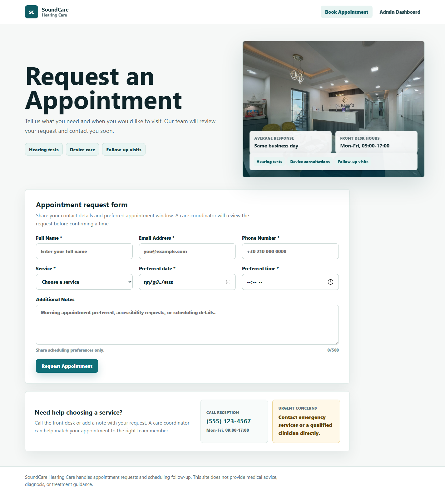
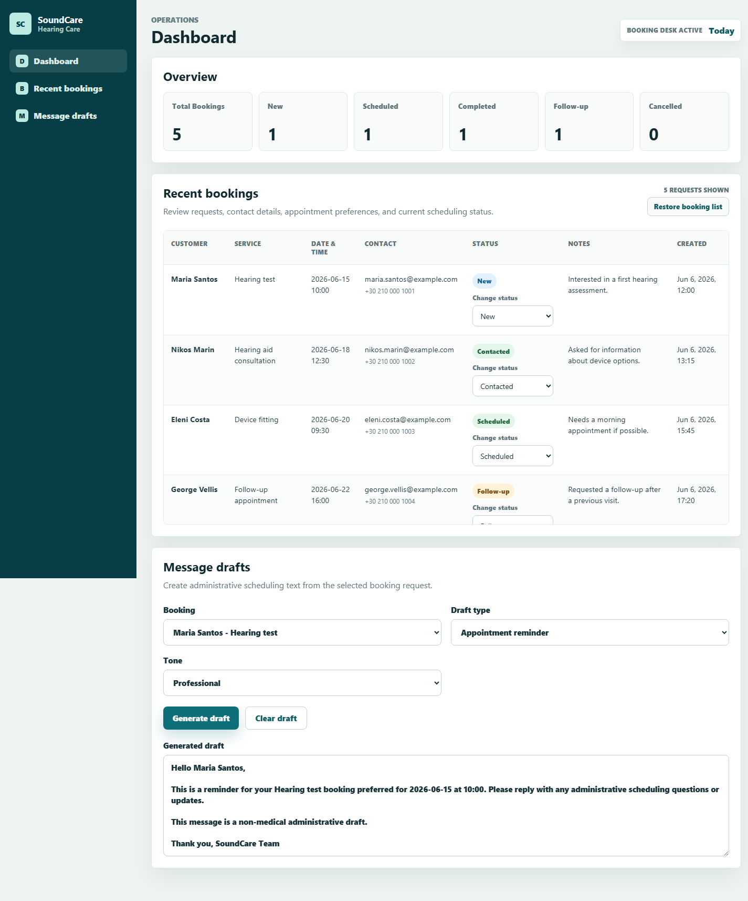
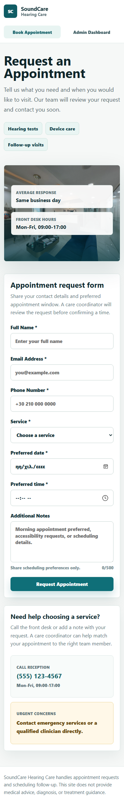

# SoundCare Hearing Care Booking CRM


A polished React + Vite portfolio app for a hearing-care appointment workflow. Visitors can request an appointment, while an admin-style dashboard reviews bookings, tracks statuses, shows simple analytics, and prepares safe scheduling message drafts.

The project is intentionally scoped for a junior developer portfolio: professional UI, working frontend flows, automated tests, browser-safe persistence proof, clear documentation, and honest limitations.

[Live Demo](https://soundcare-ai-booking-crm.vercel.app/) | [Portfolio Walkthrough](docs/PORTFOLIO_WALKTHROUGH.md) | [Interview Readiness](docs/INTERVIEW_READINESS.md) | [AI-Assisted Development Notes](docs/AI_ASSISTED_DEVELOPMENT.md)

## Preview

### Client Booking Page



### Admin Dashboard



### Mobile Layout



Reception photo source: [Pexels clinic reception image](https://www.pexels.com/photo/modern-luxury-clinic-reception-interior-design-31844508/).

## Why This Project Exists

This project was built to demonstrate a realistic junior-friendly product workflow without overbuilding it into a full medical platform.

It shows:

- React component structure and state-driven views.
- A professional client-facing appointment request form.
- Form validation with useful client feedback.
- A CRM-style admin dashboard with booking statuses.
- Local persistence for dashboard workflow testing.
- Browser-safe Supabase insert proof for submitted appointment requests.
- Automated tests for core behavior.
- Responsible AI-assisted development documentation.
- Clear product boundaries around privacy, safety, and scope.

## Core Features

- **Book Appointment view**: polished appointment request page with clinic context, service options, support cards, and urgent-care guidance.
- **Appointment request form**: required fields, email format validation, autocomplete hints, date/time bounds, note guidance, character counter, and success/save-status feedback.
- **Admin Dashboard view**: overview cards, scrollable recent bookings table, status badges, status controls, and useful sidebar navigation.
- **Message drafts**: template-based administrative scheduling drafts with a required non-medical safety line.
- **Analytics overview**: booking totals and status counts refresh after submissions and status updates.
- **Persistence layer**: React components use a booking repository boundary instead of talking directly to storage helpers.
- **Supabase insert proof**: submitted requests can be inserted with a publishable key when environment variables are configured.
- **Local fallback**: the app still works without Supabase configuration.

## Tech Stack

- React 18
- Vite 5
- JavaScript
- CSS
- Vitest
- React Testing Library
- Browser localStorage
- Supabase JavaScript client
- Vercel deployment

No external UI kit, authentication provider, payment provider, backend server, or real AI API is used.

## Architecture At A Glance

```text
Client booking form
        |
        v
bookingRepository.js
        |
        +-- localStorage fallback and dashboard source
        |
        +-- optional Supabase insert when Vite env vars are configured

Admin dashboard
        |
        v
bookingRepository.js -> local booking list, status updates, analytics refresh

Message drafts
        |
        v
Template-based administrative draft generation
```

The current dashboard intentionally remains local-only until authenticated admin access and Row Level Security policies are designed.

## What I Focused On

- Building a complete, understandable frontend flow.
- Keeping the UI polished but not overloaded.
- Making form and dashboard interactions feel practical.
- Separating persistence logic from React components.
- Using Supabase carefully as insert proof without exposing secret keys.
- Testing core flows instead of relying only on manual checks.
- Documenting tradeoffs clearly for interviews and code review.

## What This Does Not Claim

This is not a production medical system. It does not provide:

- Medical advice, diagnosis, or treatment recommendations.
- Real patient data handling.
- HIPAA/GDPR compliance claims.
- Authenticated admin database reads or updates.
- Payment processing.
- Real AI-generated medical or operational decisions.
- Public access to all booking records.

Those are intentionally left out so the project stays honest, focused, and appropriate for a junior portfolio.

## Running Locally

Install dependencies:

```bash
npm install
```

Start the development server:

```bash
npm run dev
```

Run tests:

```bash
npm run test
```

Build for production:

```bash
npm run build
```

If PowerShell resolves Node incorrectly on Windows, these fallback commands also work:

```bash
node node_modules/vitest/vitest.mjs run
node node_modules/vite/bin/vite.js build
```

## Optional Supabase Setup

The app works without environment variables. To enable browser-safe booking inserts, create `.env.local` from `.env.example`:

```bash
cp .env.example .env.local
```

Then add:

```text
VITE_SUPABASE_URL=https://your-project-ref.supabase.co
VITE_SUPABASE_PUBLISHABLE_KEY=your-publishable-key
```

Use only the publishable browser-safe key. Never use a secret key or service role key in frontend code, Vercel public variables, `.env.local`, or Git.

## Deployment

Live deployment: [https://soundcare-ai-booking-crm.vercel.app/](https://soundcare-ai-booking-crm.vercel.app/)

Recommended static deployment settings:

- Framework: Vite
- Build command: `npm run build`
- Output directory: `dist`
- Environment variables: optional for Supabase insert proof

## Tests And Validation

The project includes automated tests for:

- Booking storage and repository behavior.
- Booking form validation and submit flow.
- Save-status feedback.
- Dashboard listing, status controls, and cleaned visible notes.
- Analytics counts.
- Message draft safety line.
- Client/admin view switching and visible UI wording guardrails.

Latest local validation:

```text
Test Files: 7 passed
Tests: 32 passed
Production build: passed
```

## Documentation

- [Portfolio Walkthrough](docs/PORTFOLIO_WALKTHROUGH.md)
- [Portfolio Copy](docs/PORTFOLIO_COPY.md)
- [Interview Readiness](docs/INTERVIEW_READINESS.md)
- [AI-Assisted Development](docs/AI_ASSISTED_DEVELOPMENT.md)
- [Backend Persistence Plan](docs/BACKEND_PLAN.md)
- [Supabase Setup Plan](docs/SUPABASE_SETUP_PLAN.md)
- [Supabase Verification](docs/SUPABASE_VERIFICATION.md)
- [Test Plan](docs/TEST_PLAN.md)
- [Changelog](docs/CHANGELOG.md)

## Project History

The project started as a WordPress plugin idea, then pivoted to React + Vite on 2026-06-06 to better demonstrate frontend application skills. The old WordPress skeleton was removed, and the current repository is the active React version.

Development was organized into small phases: React skeleton, booking data, public form, dashboard, analytics, message drafts, testing, Supabase insert proof, deployment, professional UI polish, and GitHub presentation polish.

## Contact And Review Notes

For recruiters or reviewers: the best review path is to open the live demo, submit a sample appointment request, switch to the admin dashboard, update a booking status, and generate a scheduling draft. The README and docs explain the tradeoffs behind the current scope and what would come next in a production version.
